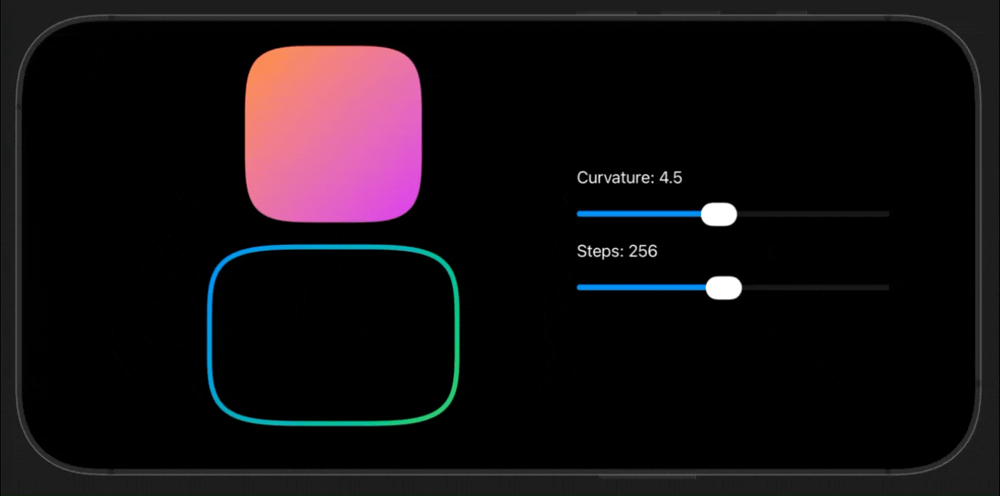

# SuperellipseShape

[](https://swift.org/)
[](https://swift.org/package-manager/)
[](LICENSE)  
[](https://developer.apple.com/ios/)
[](https://developer.apple.com/macos/)
[](https://developer.apple.com/tvos/)
[](https://developer.apple.com/watchos/)

A lightweight SwiftUI `Shape` based on the superellipse equation (`|x/a|^n + |y/b|^n = 1`). Great for buttons, cards, avatars, and other rounded components that feel softer than a rectangle and squarer than an ellipse.

## Highlights
- Configurable curvature via exponent `n` (ellipse at `n=2`, progressively squarer as `n` increases).
- Deterministic geometry with controllable `steps` for tessellation.
- Animatable: `n` conforms to `Animatable`.
- Syntactic sugar: `.superellipse` and `.superellipse(n:steps:)` on `Shape`.

## Preview



## Installation

Add via Swift Package Manager:

```swift
dependencies: [
    .package(url: "https://github.com/inekipelov/swiftui-superellipse-shape.git", from: "0.0.1")
],
targets: [
    .target(
        name: "YourTarget",
        dependencies: [
            .product(name: "SuperellipseShape", package: "swiftui-superellipse-shape")
        ]
    )
]
```

## Usage

```swift
import SwiftUI
import SuperellipseShape

struct ContentView: View {
    @State private var curvature: CGFloat = 4.5

    var body: some View {
        VStack(spacing: 24) {
            SuperellipseShape(n: curvature, steps: 256)
                .fill(.blue.gradient)
                .frame(width: 220, height: 140)

            Slider(value: $curvature, in: 2...8) {
                Text("Curvature (n)")
            }
        }
        .padding()
        .animation(.easeInOut, value: curvature)
    }
}
```
